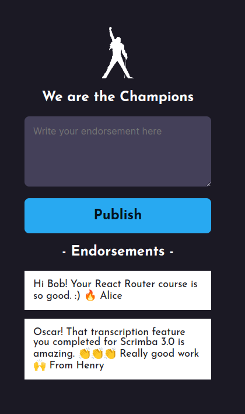

# We Are The Champions

Welcome to We Are The Champions! This is a progressive web app where users can post endorsements about each other, fostering a positive and supportive community.

## Table of Contents

1. [Features](#features)
1. [Screenshots](#screenshots)
1. [Technologies Used](#technologies-used)
1. [Installation](#installation)
1. [Usage](#usage)
1. [Contributing](#contributing)
1. [License](#license)
1. [Contact](#contact)

### Features

- **User Endorsements**: Post and receive endorsements from other users.
- **Progressive Web App**: Access the app on any device.
- **Real-time Updates**: Enjoy real-time updates using Firebase.
- **Responsive Design**: A seamless experience on both mobile and desktop.

### Screenshots



Endoresement page

### Technologies Used

- **Frontend**: HTML, CSS, JavaScript
- **Database**: Firebase
- **Deployment**: Github IO
- **CI/CD**: GitHub Actions

### Installation

1. To get a local copy up and running, follow these simple steps:

```bash
git clone git@github.com:Jarabi/we-are-the-champions.git
```

2. Navigate to the project directory:

```bash
cd we-are-the-champions
```

### Usage

- **Post Endorsements**: Share positive feedback about other users.
- **View Endorsements**: Read endorsements you’ve received and others have posted.
- **Like Endorsements**: Leave a like for favorite endorsements.
- **Progressive Features**: Add the app to your home screen.

### Contributing

Contributions are what make the open source community such an amazing place to learn, inspire, and create. Any contributions you make are greatly appreciated.

1. Fork the Project
1. Create your Feature Branch (`git checkout -b feature/AmazingFeature`)
1. Commit your Changes (`git commit -m 'Add some AmazingFeature'`)
1. Push to the Branch (`git push origin feature/AmazingFeature`)
1. Open a Pull Request

### License

Distributed under the MIT License. See LICENSE for more information.

### Contact

Alex Jarabi

X: [@jarabialex](https://x.com/jarabialex)

LinkedIn: [jarabialex](https://www.linkedin.com/in/jarabialex/)

Email: jarabialex@gmail.com

Project Link: https://github.com/Jarabi/we-are-the-champions


